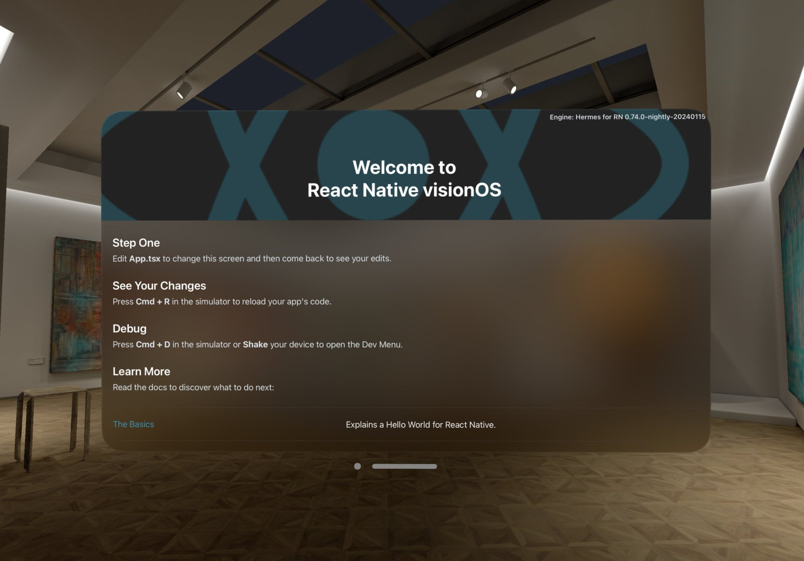

# Introduction

> Learn once, write anywhere: Build spatial apps with React.

React Native visionOS allows you to write visionOS **apps with full support for platform SDK**. This is a full fork of the main repository with changes needed to support visionOS.

## How is it different from running app in compatibility mode?

React Native visionOS unlocks full capabilities of the platform, giving your app transparent look that feels right at home next to other visionOS apps. It allows you to leverage the power of ImmersiveSpaces and multi-window apps.

Side by side comparison of running the same app: React Native visionOS vs React Native iOS (Compatibility mode).

<video width="100%" controls src="https://github.com/callstack/react-native-visionos/assets/52801365/dd5d6351-3843-4f4a-ae67-541c068ac7be"/>
